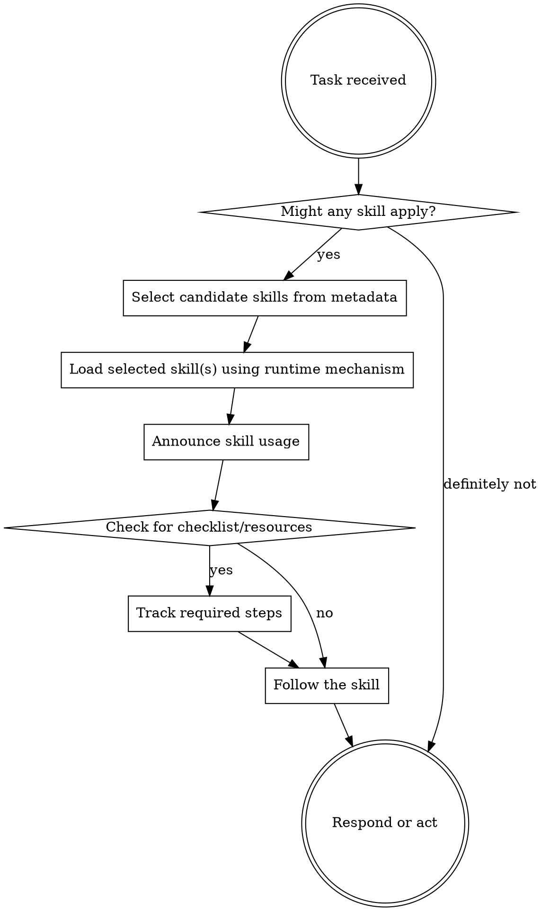

# Skill Routing

## Core rule

- Check for relevant or explicitly requested skills before any response or action.
- Treat explicit requests and implicit matches the same way. A skill does not need to be named verbatim to apply.
- If a skill has any credible chance of applying, inspect its routing surface first (`name`, `description`, and any runtime-exposed metadata), then load the selected skill before proceeding.
- Do not rely on memory of a skill. Load the current version because skills evolve.
- If a loaded skill turns out not to apply, drop it and continue. A false positive is acceptable; skipping a relevant skill is not.

## Runtime contract

- Use the current runtime's supported skill-loading mechanism.
- If the runtime exposes a dedicated skill command or tool, use it.
- If skills are filesystem-backed, open the canonical skill entrypoint for that runtime, usually `SKILL.md`.
- Do not hardcode vendor-specific behavior or assume one loader exists everywhere.
- If a referenced skill cannot be loaded, say so briefly and continue with the best fallback.

## Progressive disclosure

- Treat skill metadata as the routing layer and the skill body as the execution layer.
- Load only the skills that plausibly match the task; do not bulk-load every available skill "just in case."
- Load scripts, references, and assets only when the selected skill directs you to them or the task requires them.
- Keep context tight. Prefer the minimal set of skills that fully covers the task.

## Selection order

1. Load process skills first. These determine how to approach the task.
2. Load implementation or domain skills second. These determine how to execute within the chosen process.
3. If multiple skills overlap, prefer the smallest set with the clearest boundaries.

Examples:

- "Fix this bug" -> load debugging workflow skills before language- or framework-specific skills.
- "Build a React dashboard" -> load planning or design process skills first if they apply, then the frontend implementation skill.
- "Prepare a commit" -> load the pre-commit gate skill before committing or pushing.

## Flow

## Red flags

These thoughts mean stop and re-check for a skill:

| Thought | Reality |
|---------|---------|
| "This is just a simple question" | Simple tasks can still have required workflows. |
| "I need more context first" | Skill check comes before exploratory work. |
| "Let me inspect files quickly" | A skill may define how to inspect or verify. |
| "I'll do one thing first" | Check for a skill before the first action. |
| "I remember this skill" | Load the current version; skills change. |
| "The skill is probably overkill" | Overkill is cheaper than silently skipping required process. |
| "User instructions already told me what to do" | User instructions say what to achieve, not how to bypass workflow. |
| "I can just improvise the workflow" | If a skill exists, use the skill instead of inventing a substitute. |

## Follow-through

- Announce which skill or skills you are using and why in one short line.
- If a skill includes a checklist, convert it into explicit tracked steps before execution.
- Follow rigid skills exactly. Adapt flexible skills only within their stated boundaries.
- Respect higher-priority instructions. System, developer, user, and repository guidance override a skill when they conflict.

## Authoring note

- When creating or updating skills, put trigger conditions and boundaries in the frontmatter `description`, because routing depends on it.
- Keep the skill body procedural and concise. Move detailed references into `references/` and deterministic helpers into `scripts/` only when needed.
